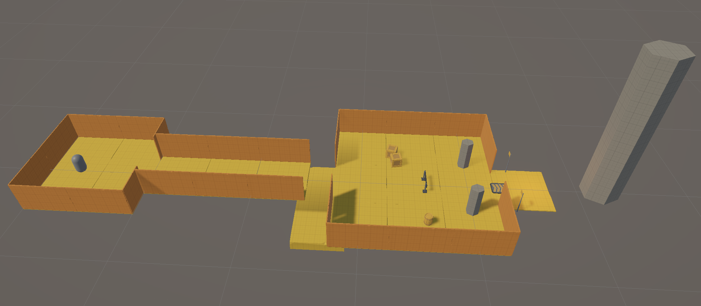

# ITU-CS-464-LAB-03-BSCS23051

**Course:** CS-464 Game Development, Information Technology University
**Lab 03:** Level Blockout
**Name:** Muhammad Talha
**Roll number:** BSCS23051

---

## 1. Overview

This lab is a single greybox (blockout) level called **Reactor Escape**, built in Unity with the *POLYGON Prototype Pack* by Synty. The player starts in a small room, follows a corridor, jumps across a gap, crosses a hall with cover, and reaches a lit goal marked by a tall tower.

The level is a beginner-friendly layout: one clear path, one obstacle per area, and no art beyond plain shapes. The aim is to check scale and flow before any decoration.

| Item | File |
|---|---|
| Level screenshot | [Screenshots/overview.png](Screenshots/overview.png) |
| Scene-view walkthrough | [Recordings/walkthrough.mov](Recordings/walkthrough.mov) |
| Reference image | [Reference/reference_image.jpeg](Reference/reference_image.jpeg) |
| Reference video | [Reference/reference_video.mp4](Reference/reference_video.mp4) |
| Unity scene | `Assets/Scenes/ReactorEscape.unity` |

## 2. Screenshot



The path runs left to right:

1. **Spawn room** (capsule inside)
2. **Corridor**
3. **Jump gap** (the lower slab below the hall's entrance)
4. **Hall** with cover
5. **Goal** and landmark tower (far right)

## 3. Walkthrough video

The recording flies through the level in Scene view, from spawn to goal, in the order above.

[Watch the walkthrough](Recordings/walkthrough.mov)

## 4. Level explanation

Measurements are in metres. The player scale reference is Unity's default capsule, 2 m tall and 1 m wide.

### 4.1 Spawn room
A 10 × 10 m room with 3 m walls and a 4 m wide doorway on the far side. The capsule starts here, so the room also serves as a scale check. The player has nothing to fight or avoid, only a single exit to move toward.

### 4.2 Corridor
A straight corridor, 5 m wide and 15 m long, with 3 m walls. It teaches the player where to go and gives a calm moment before the first obstacle.

### 4.3 Jump gap (main obstacle)
The corridor ends 2.5 m before the hall's floor begins. The player must jump the gap. A floor sits 3 m below, so a fall is clear and recoverable, and the player can see where they went wrong. The gap is under the 3 m jump distance used in class, so it is fair at beginner level.

### 4.4 Hall
A 15 × 15 m room, entered through a 4 m doorway. It holds:
- Two crates and a barrel, as low cover.
- A barrier in the middle of the room.
- Two cylinder pillars near the exit.

These objects break up the open space. They test how the player moves around objects and give them places to stop and look. The exit is another 4 m doorway on the far wall.

### 4.5 Goal
A short floor past the hall's exit holds a boost pad, two flag poles and a warm orange point light. A 15 m tall tower stands behind it as a landmark. The tower is visible from the hall, so the player can see where they are heading before they reach the exit.

### Obstacles summary

| Obstacle | Where | What it tests |
|---|---|---|
| Doorways (4 m) | Spawn, hall | Scale and flow between rooms |
| Jump gap (2.5 m) | End of corridor | Jump timing and distance |
| Crates, barrel, barrier | Hall | Moving around cover |
| Pillars | Hall | Navigating around obstacles |
| Tower and warm light | Goal | Wayfinding |

## 5. Reasons for my design choices

- **Simple and readable.** This is my first level, so I kept to one path with one obstacle per area. A blockout should answer one question: can the player get from spawn to goal, and does it make sense?
- **Scale first.** Everything is sized against the 2 m capsule. Doorways are 4 m, well over the 1.5 m minimum from the lecture, and the walls are 3 m high.
- **One real obstacle.** The jump gap is the only thing that can stop the player. It gives the level a skill check without making it hard.
- **Cover for pacing.** The hall gives the player an open space after the tight corridor, a small version of the "pinch and release" idea.
- **Wayfinding without art.** The tower and the warm light behind the goal guide the player. Players tend to move toward light and tall landmarks, and both work in a plain grey level.
- **Colour for readability.** Floors, walls and obstacles use different colours, so the layout is easy to read in the screenshot and recording.
- **Inspired by Portal.** I chose *Portal* Test Chamber 00 as my reference because it is a clear chain of connected rooms with a single route and a lit exit. I kept that idea and made my version more game-like with a jump and cover.

## 6. References

**Reference image:** a top-down map of *Portal* Test Chamber 00 (`Reference/reference_image.jpeg`).

- What I took from it: a single connected path of rooms, a narrow passage between them, doorways, and a clear start and end.

**Reference video:** a short clip of *Portal* Test Chamber 00 (`Reference/reference_video.mp4`).
- What I took from it: how the player moves from the start through the rooms to the exit, and how the exit is made obvious.

*Portal* is by Valve (2007). These references are used only to study layout and flow for a coursework exercise.

## 7. Tools

- Unity (project created from the 3D template)
- POLYGON Prototype Pack, Art by Synty (provided with the lab)
- Git and GitHub for version control

## 8. Repository layout

```
ITU-CS-464-LAB-03-BSCS23051/
├── Assets/                (Unity project assets, including Assets/Scenes/ReactorEscape.unity)
├── Packages/
├── ProjectSettings/
├── Reference/             (reference image and video)
├── Screenshots/           (overview.png)
├── Recordings/            (walkthrough.mov)
└── README.md              (this document)
```
